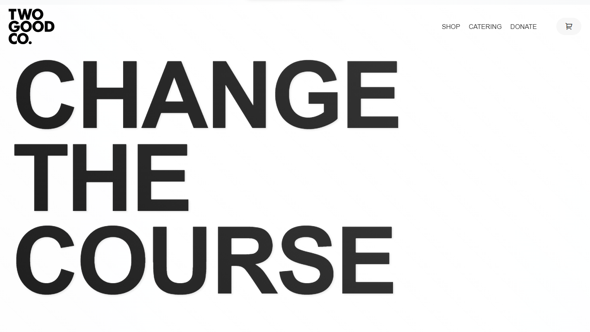
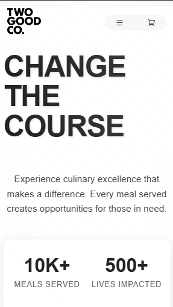

# Two Good Co Clone

A modern, responsive website clone of Two Good Co featuring smooth animations, interactive elements, and a mobile-first design approach.


## 🌟 Features

- Smooth scroll animations using Locomotive Scroll
- Interactive cursor effects
- Responsive design for all devices
- Mobile-friendly navigation
- Dynamic content sections
- Modern UI/UX with GSAP animations
- Contact form integration
- Social media integration

## 🛠️ Built With

- HTML5
- CSS3
- JavaScript
- GSAP (GreenSock Animation Platform)
- Locomotive Scroll
- Remix Icons

## 🚀 Live Demo

[View Live Demo](https://qaiserejaz.github.io/clone-Too-Good-Co/)

## 📱 Screenshots

### Desktop View


### Mobile View


## 🔧 Installation

1. Clone the repository:
```bash
git clone https://github.com/QaiserEjaz/clone-Too-Good-Co.git
```